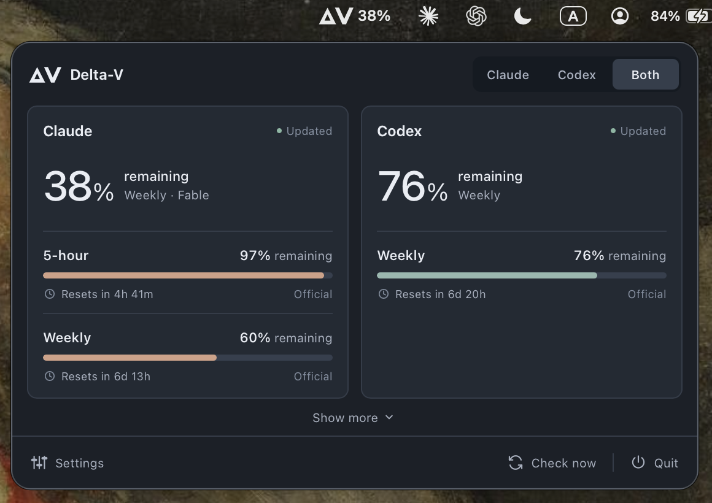
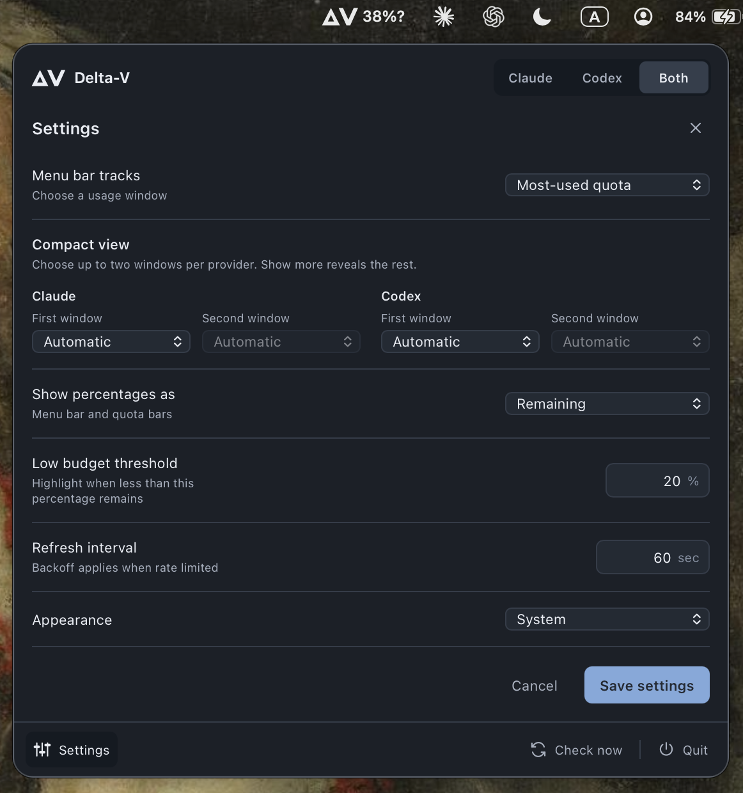

# Delta-V

See how much Claude Code and Codex usage you have left, from your Mac's menu bar. View either provider or both side by side, and choose which usage window appears beside `ΔV`.

The name comes from spaceflight: a finite budget until the next refill.



## Install

Delta-V is still in development. There is no downloadable app or Homebrew package yet. For now, you need to build it from source on a Mac.

You need [Node.js](https://nodejs.org/en/download) 22.12 or newer, [Rust](https://rust-lang.org/tools/install/), and the [Xcode command line tools](https://developer.apple.com/documentation/xcode/installing-the-command-line-tools) installed.

1. Download the source from this repository using **Code → Download ZIP**, then unzip it.
2. Open **Terminal**. Type `cd `, including the space, then drag the extracted folder into Terminal and press Return. Use the folder containing `package.json`.
3. Run these commands, one at a time:

```sh
npm ci
npm run tauri -- build -- --locked
./src-tauri/target/release/delta-v
```

The first two commands build the app. The last command opens Delta-V. Look for **ΔV in the menu bar at the top of your screen**, near the clock. It does not open a regular window or appear in the Dock.

Keep that Terminal window open while using this source build. To quit, click ΔV, then **Quit**. To open it again, run the last command from the same folder; you only need to rebuild after changing or updating the source.

## Connect your accounts

You can use Claude, Codex, or both. You only need an account for the provider you want to see.

Delta-V reads the sign-in saved by each provider's terminal app, also called a CLI. If you already use those tools on this Mac, you may already be signed in.

| Provider | Account needed | How to sign in |
| --- | --- | --- |
| Claude | A Claude account with a subscription that includes Claude Code | Install [Claude Code](https://code.claude.com/docs/en/quickstart). Run `claude` in Terminal, then enter `/login` at its prompt and choose your Claude subscription account. See [Claude's sign-in options](https://code.claude.com/docs/en/authentication). |
| Codex | A ChatGPT account with access to Codex | Install [Codex CLI](https://learn.chatgpt.com/docs/codex/cli). Run `codex login` in Terminal and sign in with ChatGPT in the browser. See [Codex's sign-in guide](https://learn.chatgpt.com/docs/auth). |

Signing in on claude.ai or chatgpt.com alone does not set up the terminal app. Delta-V does not have its own login screen, and you do not need to copy a password or token into it. API-key, Claude Console, and third-party cloud-provider billing are not supported.

Claude Desktop's Code tab has its own sign-in path. Delta-V currently reads the standalone Claude Code CLI credential, so usage working in the desktop app does not confirm that Delta-V's credential is still valid. Follow the Terminal steps above even if you normally use the Code tab.

After signing in, click ΔV and select **Claude**, **Codex**, or **Both**. If Delta-V was already open, choose **Check now**. macOS may ask for Keychain access so the app can read the saved sign-in. See [Privacy](#privacy) for exactly what it reads.

## Using it

Click ΔV to open the usage panel. The **Claude / Codex / Both** picker chooses which providers you see. **Show more** reveals additional windows, credits, and provider details. Clicking outside closes the panel; the next opening starts compact again.

Under **Settings → Compact view**, choose a first and optional second window for each provider. For example, show Claude's five-hour window alongside its weekly model limit, and choose different windows for Codex. **Automatic** lets Delta-V choose. These settings control the compact rows. Show more always reveals all reported limits the app understands.

Percentages show **remaining** usage by default. A window at 55% used has 45% remaining. Under **Settings → Show percentages as**, choose **Used** if you prefer. This changes the menu bar, the large provider percentages, and the usage bars together.

By default, the menu bar tracks the most-used available window among the selected providers. **Settings → Menu bar tracks** lets you choose a particular five-hour, weekly, or model-specific window instead. Each provider's large percentage shows its most-used window, unless you track a specific one from that provider.

The percentages and bar fill change colour when less than 20% remains. When showing remaining usage, the bar is empty at 0%, so the warning colour appears on the numbers. You can change the threshold in Settings. It always refers to what remains, even when you choose to display the percentage used. The menu bar icon itself follows the normal macOS colour.

**Appearance** offers Light, Dark, or System, which follows your Mac's appearance. Changes preview immediately. **Save settings** keeps them; **Cancel** or closing the panel restores the saved appearance.



Usage updates automatically. **Check now** requests the latest reading; it cannot reset or replenish your allowance.

## FAQ

**Does checking usage spend tokens or use up my allowance?**

Delta-V asks the provider for your account's usage reading. It does not send prompts, generate responses, or run either coding assistant. These checks are not model calls and are not expected to consume model tokens or subscription allowance. The usage services have their own request limits, so checking too often can make them ask the app to wait.

**Why does it say Stale or ask me to wait?**

Delta-V could not get a fresh reading, so it shows the last one with a stale label. If the provider asks it to wait, a countdown shows when it can try again. It retries automatically, and Check now respects the same wait. A `?` beside a menu bar percentage means that reading is stale; `?` on its own means no usable percentage is available.

**Why hasn't the percentage changed at the reset time?**

Delta-V waits for a new reading from the provider before showing a refill. A countdown reaching zero does not confirm that the provider has reset the window yet.

**Do Claude Code and Codex need to stay open?**

No. Delta-V reads their saved sign-ins independently, but it relies on the CLIs to renew them. If Claude disconnects, open Terminal, run an up-to-date `claude`, then enter `/usage` at its prompt. That command can renew an expired access token without sending a model prompt. Check for a warning about last-known usage: Claude Code can display cached figures when the request fails. Use `/login` if it reports a sign-in failure, then choose **Check now** in Delta-V. For Codex, use `codex login` in Terminal if its sign-in needs renewing.

**Does it start when I log in to my Mac?**

Not yet. This build needs to be started manually.

## Where the numbers come from

Percentages, reset times, and credit balances come from Anthropic and OpenAI's account usage services. **Official** means the number was reported by the provider. It does not mean Delta-V is affiliated with either company.

Each usage window is shown separately. Missing values stay unavailable. A credit balance without a spending limit stays a balance. Fields the app cannot interpret are listed under **Show more → Provider details** and do not affect the menu bar percentage.

The providers have not published a stable interface for third-party apps to these services, or specified how quickly new usage appears in them. Readings can lag behind your activity. Delta-V checks less often while your Mac is idle and pauses while the screen is locked.

## Privacy

Delta-V runs on your Mac. There is no Delta-V server, telemetry, analytics, or separate account. Your credentials and usage data are not sent to the maintainer. The interface uses system fonts and loads no remote assets.

The app contacts only these usage endpoints:

- [Anthropic usage](https://api.anthropic.com/api/oauth/usage)
- [OpenAI usage](https://chatgpt.com/backend-api/wham/usage)

Each provider receives its own saved access token with the request. OpenAI also receives the selected account ID. Credentials stay in the Rust backend and are never passed to the usage panel. Delta-V does not read browser cookies, renew tokens, or change either CLI's credentials.

This build does not read conversations, project files, or session logs. Usage readings stay in memory and are lost when you quit. Settings are saved locally.

<details>
<summary>Every file and Keychain item Delta-V reads or writes</summary>

The app reads these locations:

| Location | Purpose |
| --- | --- |
| Keychain service `Claude Code-credentials`, account `$USER` | Claude access token |
| `~/.claude/.credentials.json` | Claude fallback when the Keychain item is missing |
| `~/.codex/config.toml` | Codex credential-storage setting |
| `~/.codex/auth.json` | Codex file-based sign-in |
| Keychain service `Codex Auth`, account `cli\|<hash>` | Codex sign-in when configured for `keyring` or `auto` |
| `~/.config/delta-v/config.toml` | Delta-V settings |

Custom CLI directories change the credential paths above:

- Claude uses `CLAUDE_SECURESTORAGE_CONFIG_DIR` when set, then `CLAUDE_CONFIG_DIR`. An empty or absent effective override selects `~/.claude`. For a nonempty override, the Keychain service becomes `Claude Code-credentials-<hash>`. The suffix is the first eight SHA-256 characters of the override after Unicode normalization.
- Codex uses `CODEX_HOME`, or `~/.codex` by default. Its Keychain account suffix is the first sixteen SHA-256 characters of that directory's canonical path. Codex's storage setting determines which store is read. An access denial does not cause a fallback to another store.

Delta-V writes `~/.config/delta-v/config.toml`, using `~/.config/delta-v/config.toml.tmp` while saving. It does not write a usage history or a separate copy of your credentials.

</details>

## Configuration

All settings are available in the usage panel. You do not need to edit a file.

For manual configuration, quit Delta-V, edit `~/.config/delta-v/config.toml`, then restart it.

| Key | Default | Choices |
| --- | --- | --- |
| `providers` | `"both"` | `"claude"`, `"codex"`, or `"both"` |
| `tracked_limit` | `"auto"` | Most-used quota, or an available provider/limit ID chosen in Settings |
| `claude_windows` | `[]` | Up to two Claude limit IDs for the compact rows, in display order; empty means Automatic |
| `codex_windows` | `[]` | Up to two Codex limit IDs for the compact rows, in display order; empty means Automatic |
| `percentage_mode` | `"remaining"` | `"remaining"` or `"used"`, for the menu bar, provider summaries, and usage bars |
| `threshold` | `20` | Highlight when remaining usage falls below this percentage, from 0 to 100 |
| `refresh_seconds` | `60` | Base refresh interval, from 30 to 900 seconds; idle and error backoff still apply |
| `theme` | `"system"` | `"system"`, `"light"`, or `"dark"` |

## Roadmap

- [x] Build and run from source on macOS.
- [ ] Offer a signed, notarized `.dmg` download that installs into Applications.
- [ ] Add a Homebrew cask for installation and updates.
- [ ] Add Launch at login to Settings.
- [ ] Show today's usage and the last seven days, with history stored on your Mac.

Under consideration: API usage and spending in a separate view. API billing would need its own data sources and account setup, and would stay separate from subscription allowances.

## Contributing

Bug reports, fixes, and clearer documentation are welcome. For a new feature, open an issue first so we can discuss how it fits.

See [CONTRIBUTING.md](CONTRIBUTING.md) for development setup, testing, and how to send a pull request.

## License

[MIT](LICENSE)
